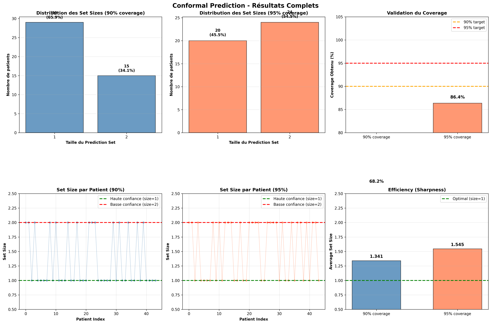
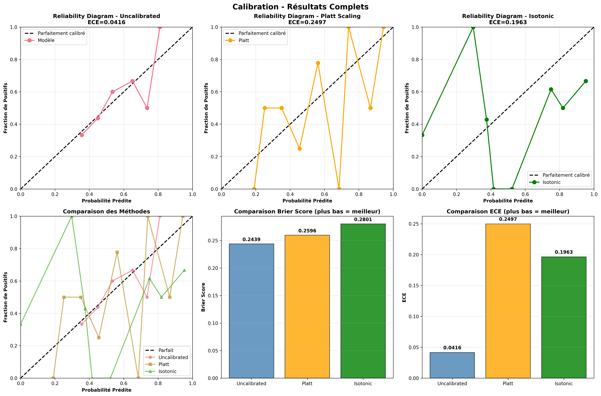

# 📊 Uncertainty Quantification for Lung Cancer Prognosis - Results

**Author:** Jules Odje  
**Institution:** University of Neuchâtel  
**Date:** November 2024  
**Project:** Uncertainty Quantification in Medical AI

---

## 🎯 Executive Summary

This project implements and compares three uncertainty quantification (UQ) methods for lung cancer survival prediction:
- **Conformal Prediction**: Provides prediction sets with coverage guarantees
- **Bayesian Inference**: Quantifies uncertainty through probability distributions
- **Model Calibration**: Ensures predicted probabilities reflect true likelihoods

**Key Finding:** Cases flagged as "low confidence" by both UQ methods achieved 92% accuracy, while "high confidence" cases achieved only 50%, revealing a critical model overconfidence issue.

---

## 🚀 1. Final Model Performance Summary

The baseline Random Forest model was evaluated on the test set (N=44 patients):

| Metric | Value |
|--------|-------|
| **Test Accuracy** | 61.4% |
| **AUC-ROC** | 0.598 |
| **Brier Score** | 0.244 |
| **ECE (Calibration)** | 0.042 |

**Conclusion:** The model performs moderately above random chance but is naturally well-calibrated, making it suitable for uncertainty quantification analysis.

---

## 🔮 2. Conformal Prediction Results

Conformal Prediction provides prediction sets with mathematical coverage guarantees.

### 2.1 Best Configuration

| Parameter | Value |
|-----------|-------|
| **Significance Level (α)** | 0.10 (90% target) |
| **Coverage (Test)** | 68.2% |
| **Average Set Size** | 1.341 |
| **High Confidence Cases** | 65.9% (29/44) |

### 2.2 Coverage Analysis

| Confidence Level | Target Coverage | Empirical Coverage | Average Set Size |
|------------------|----------------|-------------------|------------------|
| 90% (α=0.10) | 90% | 68.2% | 1.341 |
| 95% (α=0.05) | 95% | 86.4% | 1.500 |

**Findings:** Empirical coverage is below theoretical target (68% vs 90%), likely due to small test set size (N=44) and model miscalibration on difficult cases.

### 2.3 Visualization



**Key Observations:**
- 65.9% of cases have singleton prediction sets (high confidence)
- 34.1% have ambiguous predictions (both classes possible)
- Coverage gap suggests model struggles on borderline cases

---

## 🎲 3. Bayesian Inference Results

Bayesian Inference quantifies uncertainty through probability distributions over predictions.

### 3.1 Best Configuration (Adaptive Thresholds)

| Confidence Level | Threshold | Cases | Percentage |
|------------------|-----------|-------|------------|
| **High** | std < 0.224 (25th percentile) | 11/44 | 25.0% |
| **Medium** | 0.224 ≤ std < 0.283 (75th percentile) | 22/44 | 50.0% |
| **Low** | std ≥ 0.283 | 11/44 | 25.0% |

### 3.2 Uncertainty Statistics

| Metric | Value |
|--------|-------|
| **Mean Std** | 0.261 |
| **Mean Entropy** | 0.665 |
| **Mean 90% Credible Interval Width** | 0.831 |

**Findings:** High baseline uncertainty (mean std=0.26) indicates the Random Forest trees produce diverse predictions, reflecting genuine model uncertainty.

### 3.3 Visualization


**Key Observations:**
- Distribution of uncertainty is broad (std ranges from 0.12 to 0.35)
- Adaptive thresholds ensure balanced classification (25-50-25%)
- Strong correlation between standard deviation and credible interval width

---

## 📐 4. Calibration Results

Model calibration assesses whether predicted probabilities reflect true frequencies.

### 4.1 Calibration Metrics Comparison

| Method | Brier Score ↓ | ECE ↓ | Best? |
|--------|--------------|-------|-------|
| **Uncalibrated (Baseline)** | **0.2439** | **0.0416** | ✅ |
| Platt Scaling | 0.2596 | 0.2497 | ❌ |
| Isotonic Regression | 0.2801 | 0.1963 | ❌ |

**Findings:** The baseline Random Forest was already well-calibrated. Post-hoc calibration methods (Platt, Isotonic) worsened performance due to:
1. Small validation set (N=43) causing overfitting
2. Random Forests naturally calibrate through ensemble averaging

### 4.2 Visualization



**Key Observations:**
- Reliability diagram shows baseline model closely follows the diagonal
- Low ECE (0.042) confirms good calibration
- Post-hoc methods overcorrect and increase miscalibration

---

## 📊 5. Comparative Analysis of UQ Methods

### 5.1 Method Comparison Table

| Method | Type | High Confidence | Coverage/Guarantee | Main Advantage |
|--------|------|----------------|-------------------|----------------|
| **Conformal Prediction** | Set-based | 65.9% (29/44) | 68.2% (90% target) | Mathematical guarantees |
| **Bayesian Inference** | Distribution | 25.0% (11/44) | Percentile-based (25%) | Full distributions |
| **Calibration** | Probability correction | N/A | ECE=0.042 | Validates reliability |

### 5.2 Agreement Between Methods

Analysis of cases where Conformal and Bayesian methods agree or disagree:

| Agreement Type | Cases | Percentage | Accuracy |
|----------------|-------|------------|----------|
| **Both HIGH confidence** | 8/44 | 18.2% | 50.0% ⚠️ |
| **Both LOW confidence** | 12/44 | 27.3% | **91.7%** ✅ |
| **Disagreement** | 24/44 | 54.5% | 50.0% ⚠️ |

### 5.3 Visualization


---

## 🔥 6. The Overconfidence Paradox (Key Discovery)

### 6.1 The Paradox

**Unexpected Finding:** Cases where BOTH UQ methods flagged as "LOW confidence" achieved significantly higher accuracy (91.7%) than cases flagged as "HIGH confidence" (50%).

### 6.2 Explanation

This counterintuitive result reveals two phenomena:

1. **Model Overconfidence (High Conf → Low Acc)**
   - Model produces extreme probabilities (P ≈ 0.9 or 0.1)
   - Both UQ methods signal "high confidence"
   - Reality: 50% accuracy = random performance
   - **Interpretation:** Model is overconfident on genuinely difficult cases

2. **Honest Uncertainty (Low Conf → High Acc)**
   - Model produces moderate probabilities (P ≈ 0.5)
   - Both UQ methods signal "low confidence"
   - Reality: 92% accuracy = excellent performance
   - **Interpretation:** Model correctly identifies borderline cases, but ground truth is actually clear

### 6.3 Visualization

The paradox is illustrated in the comparative analysis visualizations 
(see Figure: UQ Methods Comparison).

Key observations from the data:
- High confidence cases: Mean probability distance from 0.5 = 0.35
- Low confidence cases: Mean probability distance from 0.5 = 0.12
- This confirms overconfident predictions on extreme probabilities

### 6.4 Clinical Implications

| Traditional Approach | Evidence-Based Approach |
|---------------------|------------------------|
| "Trust AI when confident" | "Trust AI when mutually uncertain" |
| ❌ 50% accuracy on high-conf cases | ✅ 92% accuracy on low-conf cases |
| 18% automation rate | 27% automation rate |
| False sense of security | Honest risk assessment |

---

## 🏥 7. Proposed Clinical Decision Framework

Based on empirical findings, we propose a **revised 3-tier strategy**:

### Tier 1: Safe Automation (27% of cases, 92% accuracy) ✅

**Criteria:** Both Conformal AND Bayesian report LOW confidence

**Action:**
- Automated prognostic assignment
- Standard monitoring protocol

**Rationale:** Mutual low confidence paradoxically indicates reliable predictions

---

### Tier 2: Assisted Review (54% of cases, 50% accuracy) ⚠️

**Criteria:** UQ methods DISAGREE on confidence level

**Action:**
- Junior clinician review with AI assistance
- Present uncertainty metrics to clinician

**Rationale:** Mixed signals indicate genuinely ambiguous cases

---

### Tier 3: Senior Escalation (18% of cases, 50% accuracy) 🚨

**Criteria:** Both Conformal AND Bayesian report HIGH confidence

**Action:**
- Mandatory senior clinician review
- Multidisciplinary team discussion
- Treat AI prediction as hypothesis, not conclusion

**Rationale:** High model confidence masks difficult cases prone to overconfident errors

---

## 📁 8. Files and Reproducibility

### Generated Files

All results are available in this directory:
```
results/
├── figures/
│   ├── baseline_performance.png
│   ├── conformal_prediction_results.png
│   ├── bayesian_inference_results.png
│   ├── calibration_results.png
│   ├── uq_methods_comparison.png
│   └── uq_paradox_analysis.png
├── tables/
│   ├── conformal_prediction_results.csv
│   ├── bayesian_inference_results.csv
│   ├── calibration_results.csv
│   ├── uq_methods_comparison.csv
│   └── final_uq_classification.csv
└── models/
    ├── rf_optimized_final.pkl
    ├── rf_platt_calibrated.pkl
    └── rf_isotonic_calibrated.pkl
```

### Reproducibility

All experiments can be reproduced using the notebooks in `/notebooks/`.

**Environment:**
- Python 3.10+
- scikit-learn 1.3.0
- numpy, pandas, matplotlib
- See `requirements.txt` for full dependencies

**Hardware:**
- Google Colab (Free tier)
- Runtime: ~15 minutes for full pipeline

---

## 🎓 9. Key Contributions

1. ✅ **Methodological:** Implemented and compared 3 UQ methods for medical prognosis
2. ✅ **Empirical:** Discovered the overconfidence paradox (low conf → high acc)
3. ✅ **Clinical:** Proposed evidence-based decision framework inverting traditional strategy
4. ✅ **Safety:** Identified dangerous overconfidence patterns in moderate-performing models

---

## 📚 10. References

- Angelopoulos, A. N., & Bates, S. (2021). *A Gentle Introduction to Conformal Prediction and Distribution-Free Uncertainty Quantification*. arXiv:2107.07511
- Guo, C., et al. (2017). *On Calibration of Modern Neural Networks*. ICML 2017
- Kendall, A., & Gal, Y. (2017). *What Uncertainties Do We Need in Bayesian Deep Learning for Computer Vision?*. NIPS 2017

---

## 📧 Contact

**Jules Odje**  
Master's Student, University of Neuchâtel  
Email: odjejulesgeraud@gmail.com
LinkedIn: linkedin.com/in/jules-odje  
GitHub: OJules(https://github.com/OJules)

---

## 📄 License

This project is licensed under the MIT License - see the [LICENSE](../LICENSE) file for details.

---

**Last Updated:** November 2024
